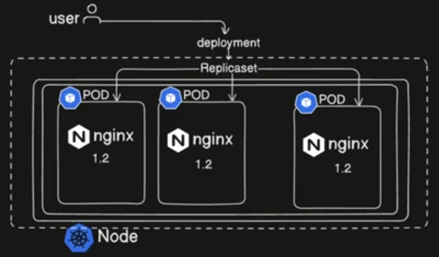

# Deployment
A kubernetecs deployment is a higher-level resource in kubernetes that provides declarative updates for pods and ReplicaSets. It manages the lifecycle of application, ensuring that a specified number of Pod replicas are running and handling updates and rollback in a controller manner. 

## Important Concept 
Everything do in kubernetes, do host application as a container on the pod and pod has to be back by a replica set or stateful set or deployment.

## ReplicaSets
A ReplicaSet in Kubernetes is a controller that ensures a specified number of identical Pod replicas are running at all times. It is a key componet for maintaining application availability and enabling self-healing capabilities within a kubernetes cluster. 



## Kubernetes Deployment entails:
- Define the desire state of application with the deployment manifest. (e.g. how many Pods should run, which container image to user how updates should be applied)

- A Deployment creates and manage ReplicaSets, which in turn manage the creating and scaling of individual pods. This abstraction simplifies the management of multiple Pod replicas. 

- Deployment facilitate rolling updates, allowing to update application with new versions without downtime. This involves gradually replacing old Pods with new ones, ensuring continuous availability. 

- If an update introduces issue, Deployments enable easy rollback to a previous stable version of an application

- If Pod or the node it's running of fails, the Deployment controller automatically replaces it, providing resilience and high availbility. 

- Scaling application up and down by adjusting the number of replicas. 

## Imperative way to create deployment
```
kubectl create deployment "Name_OF_Deployment" --image="Image name"
```

## Some important commands for deployment
1. See the deployment rollout status

    ```kubectl rollout status deployment/"deployment_name"```
2. Checking Rollout History of a deployment

    ``` kubect rollout history deployment/"deployment_name" ```

3. Rolling back to the previous version 

    ``` kubectl rollout undo deployment/"deployment_name"```

4. Scaling deployment

    ``` kubectl scale deployment/"deployment_name" --replicas=10```

## Note
While we can create ReplicaSets directly, in most common scenarios, ReplicaSets are managed implicitly by Deployments. A Deployment is a higher-level abstraction that provides ``declarative updates for Pods and ReplicaSets``. When we create a Deployment, it automatically creates and manages ReplicaSets to handle the desired state and updates of our application. This allows for features like rolling updates, rollbacks, and scaling without directly interacting with ReplicaSets.

Deployment Docs: https://kubernetes.io/docs/concepts/workloads/controllers/deployment/