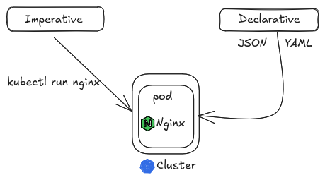

# Pods
In Kubernetes, a Pod is the smallest and most fundamental deployable unit you can create and manage. It represents a single instance of a running process in your cluster. 

## Diferent ways of creating kubernetes objects
- Imperative way (Throught command or API calls)
- Declarative Way (By creating manifest files (YAML files))



- Create a pod using the imperative command and use nginx as the image

```bash 
kubectl run nginx(Name of the pod) nginx
```

Command to apply ymal file 

```
kubectl apply -f "File path" --namespace=(Optional)
```

As there is many configurations are available for the pods and can used these configurations as per requirement. We can easily configure pods by refering this docs 
https://kubernetes.io/docs/tasks/configure-pod-container/ 

__my top pick for pod/container configuration (except port, env and other necessary configurations)__

__Resources__
```
resources:
  limits:     #A limit specifies the maximum amount of a resource (CPU or memory) that a container is allowed to consume. 
    cpu: ''
    memory: ''
  requests:   # A request specifies the minimum amount of a resource (CPU or memory) that a container requires to function correctly.
    cpu: ''
    memory: ''
```
requests and limits also influence the Quality of Service (QoS) class assigned to a Pod, which determines its priority in resource allocation and eviction scenarios.

  - Guaranteed: When requests equal limits for all containers in a Pod, it receives the highest QoS class, ensuring dedicated resources.
  - Burstable: When limits are higher than requests, it allows for temporary resource bursts while ensuring a guaranteed minimum.
  - BestEffort: If no requests or limits are defined, the Pod receives the lowest priority and is more susceptible to eviction during resource pressure.

 __Security Context__
 
 ```
 securityContext:
   runAsUser: 1000
   runAsGroup: 3000
   fsGroup: 2000
   supplimentalGroups: [4000]
 ```

__livenessProbe__

A liveness probe determines if a container is running and healthy. If the liveness probe fails, Kubernetes assumes the container is in an unhealthy state and restarts it. (Just like ecs and other serive if /health endpoint is fails then new deplyment would be discarded). Used for auto healing purpose

```
livenessProbe:
  httpGet:
    path: "httpget.path" e.g. /api/health
    port: "httpget.port"
    initialDelaySeconds: 
    periodSeconds: 
    timeoutSeconds: 
    failureThreshold
```

__Readiness Probe__

A readiness probe determines if a container is ready to serve traffic. If the readiness probe fails, Kubernetes removes the Pod's IP address from the endpoints of any Services that match the Pod. This prevents traffic from being routed to a Pod that is still initializing, performing resource-intensive tasks, or temporarily unavailable. Once the readiness probe succeeds again, the Pod is added back to the Service's endpoints

```
readinessProbe:
  httpGet:
    path: "httpget.path" e.g. /api/health
    port: "httpget.port"
    initialDelaySeconds: 
    periodSeconds: 
    timeoutSeconds: 
    failureThreshold
```